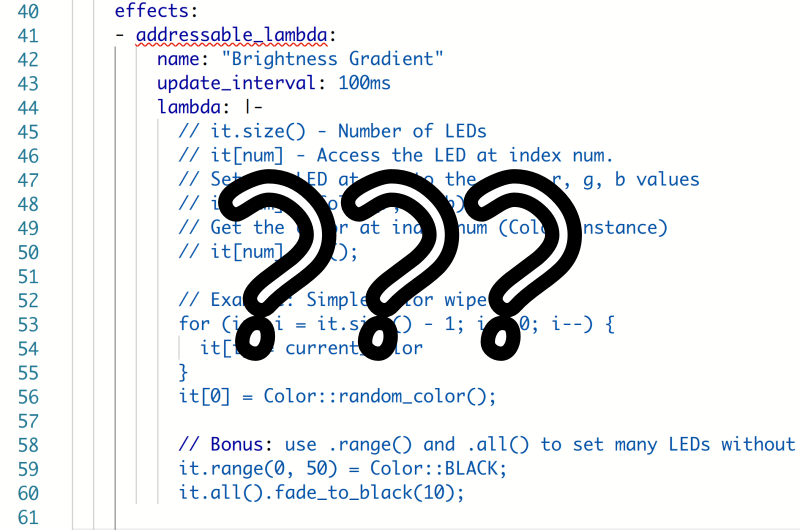

# ESP simlight

ESP simlight is a tool to, given a layout file, run arbitrary Python code
to simulate your addressable light effect lambda!

No more endless experimentation in ESPHome and wasting the flash of your
hardware away. Speed up your iteration cycles with the hot-reloading
visualizer that is called **ESP simlight**.

Example video:

https://github.com/githubnemo/espsimlight/assets/264196/cd9020cd-ccbf-4e33-b14c-fcecb9af87c7

## Installation

    poetry install

## Running

There are examples you can test:

    poetry run espsimlight examples/desklamp.shape examples/running_light.py

Try editing `running_light.py` while the simulation is running.

The shape file is just an ASCII file with all the LEDs of your addressable
light at a position of your choice - as long as each number has some form
of whitespace (newline, beginning of line, space, tab, ...) in front and
at the end of it.

### Examples

A linear strip

    1 2 3 4 5 6

A strip in a square configuration

    1  2 3 4
    12     5
    11     6
    10 9 8 7

## Limitations

Only parts of the ESPHome Color API is implemented.
If you feel that there is something missing, please open a PR.
